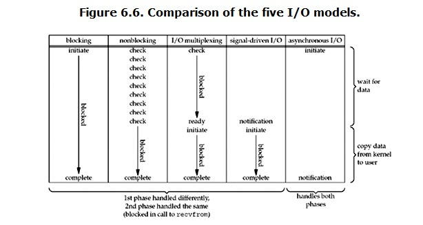

# learn-netty
IO 模型

##### BIO，同步阻塞IO，阻塞整个步骤，如果连接少，他的延迟是最低的，因为一个线程只处理一个连接，适用于少连接且延迟低的场景，比如说数据库
##### NIO，同步非阻塞IO，阻塞业务处理但不阻塞数据接收，适用于高并发且处理简单的场景，比如聊天
##### 多路复用IO，他的两个步骤处理是分开的，也就是说，一个连接可能他的数据接收是线程a完成的，数据处理是线程b完成的，他比BIO能处理更多
##### 信号驱动IO，这种IO模型主要用在嵌入式开发，不参与
##### 异步IO，他的数据请求和数据处理都是异步的，数据请求一次返回一次，适用于长连接的业务场景。

